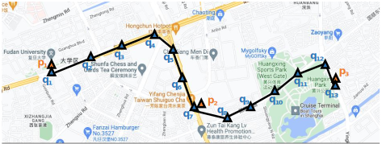

#########################
Task: Trajectory Recovery
#########################

.. image:: ../_static/trajrec.svg

Introduction
=============

GPS trajectories are essential foundations for applications such as travel time estimation, traffic prediction, and trajectory similarity measurement. However, real-life trajectories often suffer from low sample rates, limiting their effectiveness. Additionally, existing map matching algorithms face challenges with low-sample trajectories. Trajectory recovery aims to increase the sample rate by filling in missing points, enriching low-sample trajectories. 

Formal Definition
=================

Given a low-sample raw GPS trajectory $\tau$ with measurement errors (e.g., orange GPS points in the Figure), the task of trajectory recovery aims to recover the real map-matched trajectory (e.g., blue GPS points in the figure). Specifically, for each low-sample trajectory, it infers the missing GPS points and maps each GPS point (including the GPS points in the input trajectory) onto the road network to obtain the real GPS locations of the moving trajectory [1]_.

Citations
=========

.. [1] Chen, Yuqi, et al. "RNTrajRec: Road Network Enhanced Trajectory Recovery with Spatial-Temporal Transformer." arXiv preprint arXiv:2211.13234 (2022).